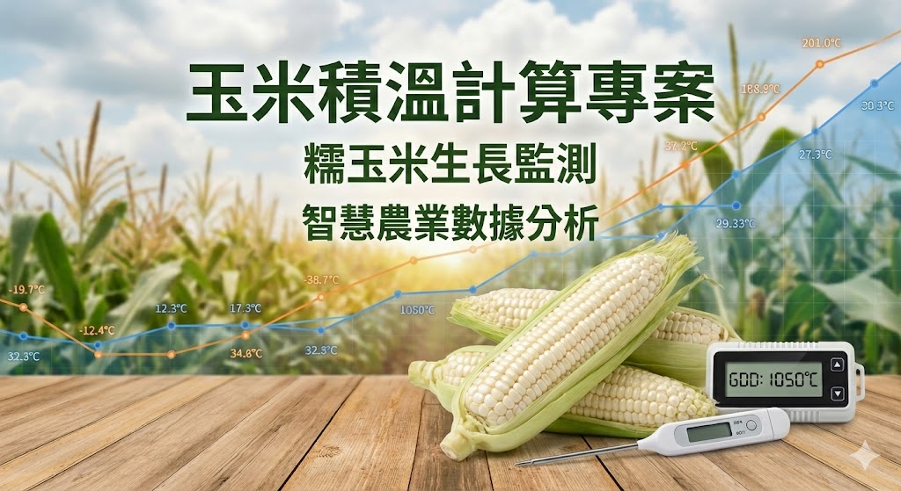
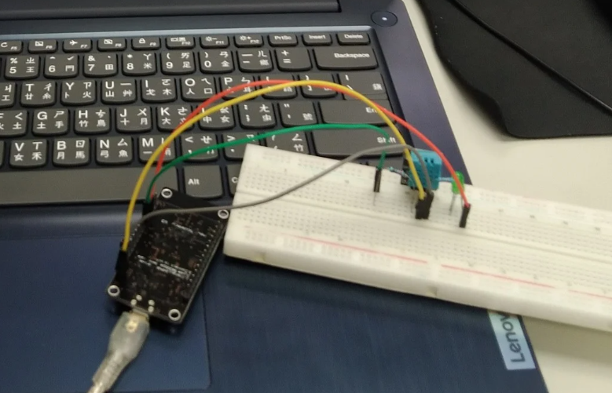

# Corn_GDD

## 專案簡介 (Introduction)

這是一個結合 **IoT (ESP8266)** 與 **Cloud Computing (Google Cloud)** 的智慧農業系統，旨在解決 **農作物（如糯玉米）生長環境監測與採收日預測** 的問題。

透過此系統，農夫不需人工記錄溫度，即可在網頁儀表板上即時監控田間狀況，並依據自動計算的 **積溫 (Growing Degree Days, GDD)**，科學化地掌握最佳採收時機。

### 核心功能
- **IoT 環境感測**：使用 ESP8266 開發板搭配 DHT11 感測器，定時採集田間溫濕度。
- **狀態指示燈**：硬體端配置 LED，於資料上傳時閃爍，即時反饋連線狀態。
- **雲端積溫運算**：透過 Google Apps Script 接收數據，並在 Google Sheets 自動計算每日有效積溫。
- **智慧採收預測**：系統依據累積積溫與目標閥值，動態推算預計採收日期與剩餘天數。
- **視覺化戰情室**：使用 Google Looker Studio 將數據轉化為即時圖表與進度儀表板。

---

## 系統架構 (System Architecture)


### 技術堆疊 (Tech Stack)
- **MCU / Edge Node**: ESP8266 (NodeMCU v2 / Wemos D1 Mini)
- **Sensors**: DHT11 (AM2302) Temperature & Humidity Sensor
- **Connectivity**: WiFi (2.4G) / HTTPS REST API
- **Backend / Cloud**: Google Apps Script (GAS) Serverless Functions
- **Database**: Google Sheets
- **Dashboard**: Google Looker Studio (Data Studio)

---

## 硬體配置 (Hardware Setup)


### 接線說明列表
1. **DHT22 VCC** -> ESP8266 **3V3** (※注意：請勿接 5V5
2. **DHT22 GND** -> ESP8266 **GND**
3. **DHT22 DATA** -> ESP8266 **D4 (GPIO 2)**
4. **LED 正極 (+)** -> 電阻 -> ESP8266 **D3 (GPIO 0)** (資料傳輸指示燈)
5. **LED 負極 (-)** -> ESP8266 **GND**

---

## 快速啟動 (Quick Start)

本專案分為雲端設定與硬體燒錄兩部分，詳細步驟請參閱教學 PPT，以下為簡易流程檢核表：

### 1. 雲端環境準備 (Google Cloud side)
- [ ] 建立 Google Sheet 並設定好 `Data` 與 `Summary` 分頁結構。
- [ ] 建立 Google Apps Script 專案，貼上後端程式碼。
- [ ] 將 Script 部署為網頁應用程式 (Web App)，權限設定為「所有人 (Anyone)」。
- [ ] 複製取得的 **Web App URL (Script ID)**。

### 2. 硬體韌體燒錄 (Firmware side)
- [ ] 使用 Arduino IDE 開啟韌體程式碼。
- [ ] 安裝必要函式庫：`DHT sensor library` 與 `Adafruit Unified Sensor`。
- [ ] 修改程式碼中的設定檔：
    ```cpp
    const char* ssid = "YOUR_WIFI_SSID";     // 替換成你的 WiFi 名稱
    const char* password = "YOUR_WIFI_PASS"; // 替換成你的 WiFi 密碼
    const String GAS_ID = "YOUR_SCRIPT_ID";  // 替換成步驟 1 取得的 ID
    ```
- [ ] 將程式碼上傳至 ESP8266 開發板。

### 3. 驗證與監控
- [X] 開發板上電後，觀察 LED 是否在傳輸時閃爍。
- [X] 檢查 Google Sheet 的 `Data` 分頁是否有數據寫入。
- [X] 前往 Looker Studio 儀表板查看即時圖表與預測結果。
